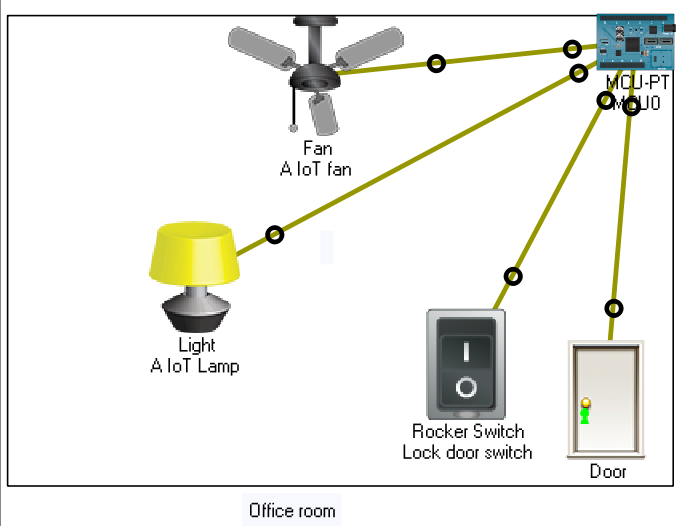
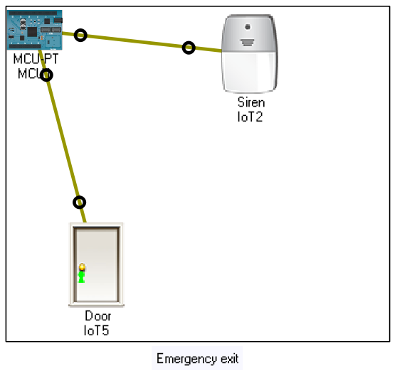
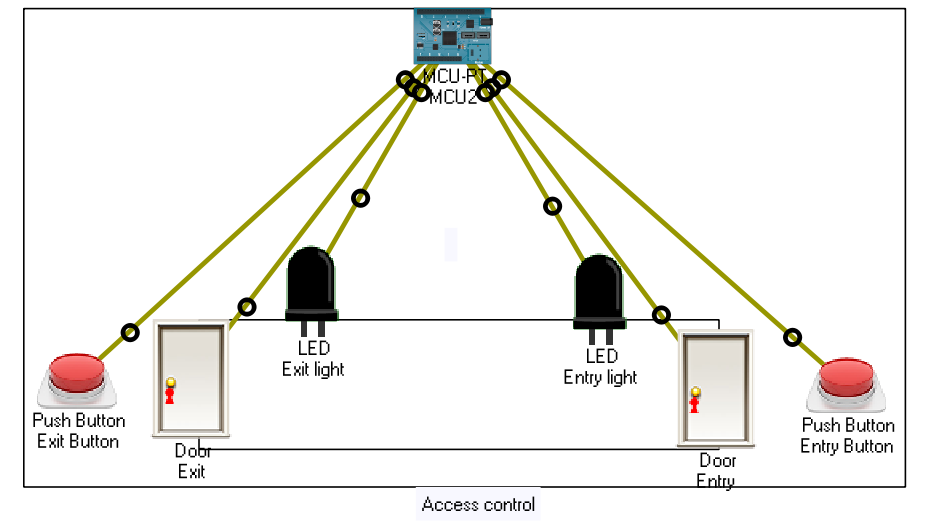
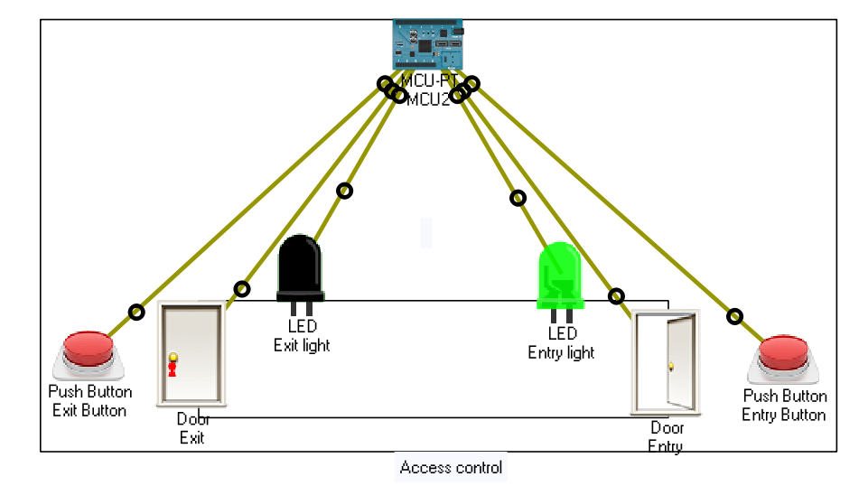
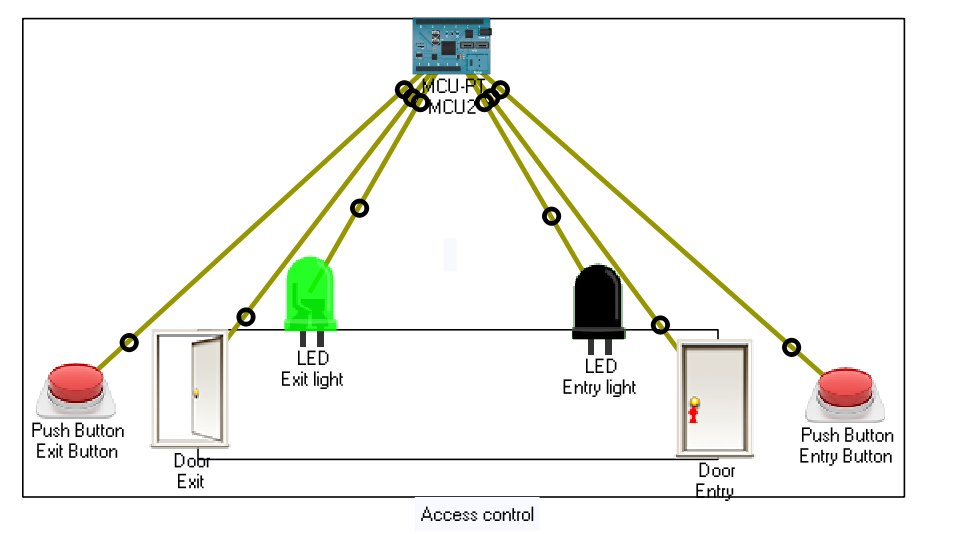
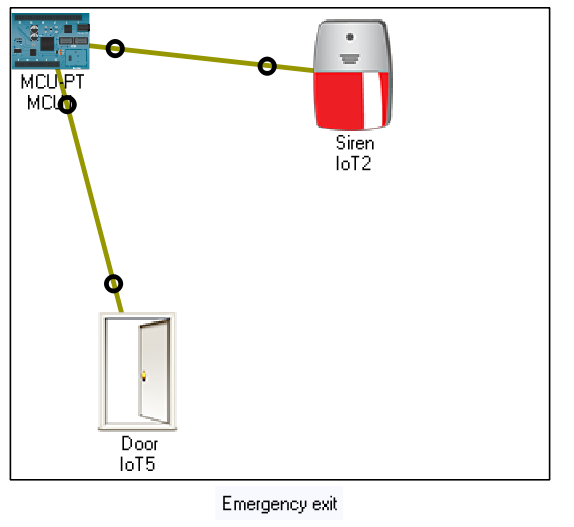
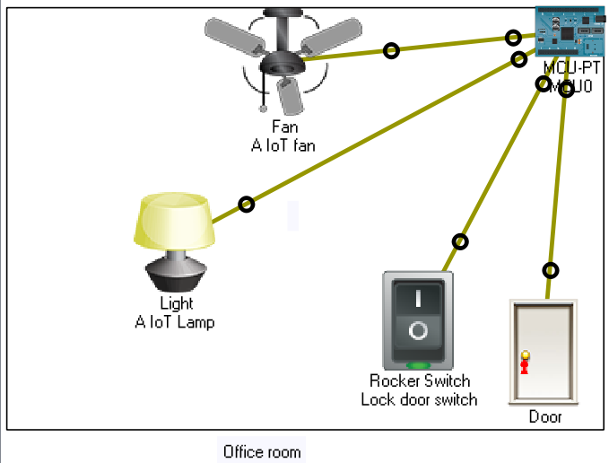
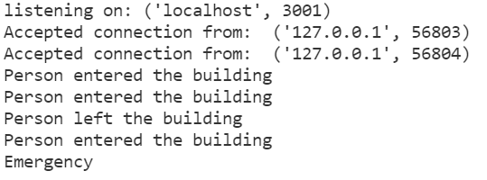
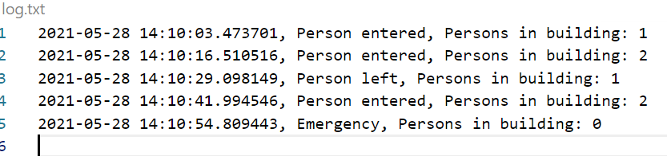

# Office Internet of Things demo
Project demostrates how to connect office equipment with server.

Usage of IoT equipment is demostrated using Cisco packet tracer. Main scripting language is Python 3. Python is used mainly on the server side but also programming the office equipment.

## Table of contents
- [Office Internet of Things demo](#office-internet-of-things-demo)
  - [Table of contents](#table-of-contents)
- [Project](#project)
- [Usage](#usage)
- [Server](#server)
- [Office](#office)
    - [Office room](#office-room)
    - [Emergency exit](#emergency-exit)
    - [Access control](#access-control)
- [Demo](#demo)
  - [Entering the building](#entering-the-building)
  - [Exit the building](#exit-the-building)
  - [Using emergency exit](#using-emergency-exit)
  - [Entering office room](#entering-office-room)
  - [Server side logs](#server-side-logs)

[Top &#8593;](#office-internet-of-things-demo)

# Project

The project contains two parts. TCP server and the office. Detailed description of the project can be found [here](./documents/assignment.pdf).

[Top &#8593;](#office-internet-of-things-demo)

# Usage
Clone repository. Run the [server.py](./src/server.py) script. Open [office_building.pkt](office_building.pkt) with Cisco packet tracer. Play around!

You can also see demonstration of the usage [here](#demo).

[Top &#8593;](#office-internet-of-things-demo)

# Server
The server is build using python 3. It is a TCP server that accepts multiple client connections.

[Top &#8593;](#office-internet-of-things-demo)

# Office
Office contains three rooms. Office room, emergency exit and access control.

[Top &#8593;](#office-internet-of-things-demo)

### Office room

Equipment in the room is connected to each other.

For more detailed demonstration see [demo](#entering-office-room).

[Top &#8593;](#office-internet-of-things-demo)

### Emergency exit

When the emergency exit is opened the siren turns on and the server is notified.

Closing the door turns the siren off.

[Top &#8593;](#office-internet-of-things-demo)

### Access control

The access control keeps count of the persons entering and leaving the building.

When users enters the building they must push entry button. Then the entry light is illuminated and the door is open. After five seconds has passed the entry door is closed and the exit door is opened for the user to enter the building. In the meanwhile server is notified that a person has entered the building.

When user wants to leave the building they must push the exit button. The entry flow is repeated in reverse. The server is notified that a person has left the building.

[Top &#8593;](#office-internet-of-things-demo)

# Demo

This demo shows what happens when user
- enters the building
- exits the building
- uses the emergency exit
- enters the office room
- Server side logs

[Top &#8593;](#office-internet-of-things-demo)

## Entering the building
When the user enters the building he/she must first go throug the access control.

Pressing the enter building illuminates the enter light and opens the enter door.

After five seconds the door and the ligth are closed and the exit door is opened.

After the user has left the access control the doors are closed and locked.

While a user is using the access control other users has to wait their turn.

In the meanwhile the [server](#server-side-logs) is notifed that a person entered the building.

[Top &#8593;](#office-internet-of-things-demo)

## Exit the building
Leaving the office reversed the entering order.

Pressing the exit button opens the exit door.

After five seconds the door is closed and the entry door is opened.

User has left the building. Meanwhile the access control is unusable to any other person.

[The server](#server-side-logs) is notifed that a person has left the building.

[Top &#8593;](#office-internet-of-things-demo)

## Using emergency exit

Initial state of the emergency exit is that the door is closed and the siren is off.

When a person opens the door a alarm goes off and [the server](#server-side-logs) is notified about the emergency.

[Top &#8593;](#office-internet-of-things-demo)

## Entering office room
Initially all the equipment in the room is turned off.

After a person has entered the room and closed the door the equipment activates. The fan rotates and the lamp illuminates. Switching the switch locks the door to give the person some privacy.

[Top &#8593;](#office-internet-of-things-demo)

## Server side logs

The server notifies in its logs when a client is connected to the server. Also when ever a person enters/leaves the building the server logs the action. This applies also to the use of the emergency exit.

Server also keeps a log file. The log file saves the type of the action and the amount of persons in the building.

[Top &#8593;](#office-internet-of-things-demo)